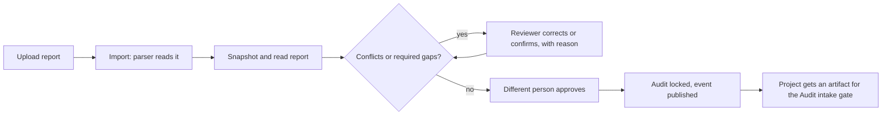

# Tech stack and processes

The developer's reference for what the system is built from and how the main processes work
end to end. Read the [developer guide](02-developer-guide.md) for how to change the code.

## 1. Tech stack

### Backend

| Layer | Technology | Why | Where |
| --- | --- | --- | --- |
| Language | Python 3.12 | Strong data and document libraries | `backend/` |
| Web framework | FastAPI, Pydantic v2 | Typed requests, automatic OpenAPI, strict validation | `app/main.py`, each `schemas.py` |
| Server | Gunicorn with Uvicorn workers | Production process model | `backend/Dockerfile` |
| Database | PostgreSQL 16 | Transactions, JSONB, partial indexes, triggers | `app/core/db.py` |
| ORM and migrations | SQLAlchemy 2 (async), asyncpg, Alembic | Async access, reviewable schema changes | `models.py`, `migrations/` |
| Cache and limits | Valkey 8 (Redis compatible, BSD) | Rate limits, broker | `app/core/redis.py`, `ratelimit.py` |
| Background jobs | Celery worker and beat | Outbox delivery, nightly jobs | `app/worker.py` |
| Object storage | MinIO (S3 API), boto3 | Uploaded reports, photos, backups, versioned | `app/core/s3.py` |
| Virus scanning | ClamAV over TCP | Every upload is scanned, fail closed | `modules/files/scanner.py` |
| Documents in | python-docx, pdfplumber, openpyxl | PrismSuite report and BOQ import | `modules/prismsuite/parsers` |
| Data tools | Polars, DuckDB, PyArrow, rapidfuzz | Dataset engine (phase 4) | installed, used from phase 4 |
| Documents out | Jinja2, WeasyPrint, qrcode | Quotation PDF, certificates (phase 6, 10) | installed, used from phase 6 |
| Auth | argon2id, PyJWT, pyotp, cryptography | Passwords, tokens, MFA, field encryption | `modules/identity`, `core/crypto.py` |
| Observability | structlog, prometheus-client, OpenTelemetry, Sentry | JSON logs, metrics, traces, errors | `core/logging.py`, `core/middleware.py` |
| Quality | pytest, hypothesis, testcontainers, ruff, mypy strict, import-linter, bandit, pip-audit | Real containers in tests, enforced boundaries | `backend/tests`, `pyproject.toml` |

### Frontend

| Layer | Technology | Why |
| --- | --- | --- |
| Framework | Next.js 15 (App Router), React 19, TypeScript strict | The agreed stack; standalone output for a small image |
| Styling | Plain CSS with design tokens | No runtime styling library, light and dark themes |
| Data | `fetch` with a small wrapper and a `useData` hook | No data library, about 110 kB first load |
| API types | `openapi-typescript` generated from the backend schema | Types are never written by hand |
| Fonts | Geist and Geist Mono through `next/font` | Self-hosted at build time |

Only Next.js and React are runtime dependencies. See `docs/design/frontend-design-plan.md`.

### Platform

| Piece | Technology |
| --- | --- |
| Containers | Docker, Docker Compose (base, dev and prod files, profiles) |
| Reverse proxy | Nginx: routes `/api` to the API and everything else to the web app |
| Monitoring | Prometheus and Grafana (provisioned dashboard) |
| Dev mail capture | Mailpit |
| CI | GitHub Actions: lint, types, boundaries, tests, security scans, image scan, migrations |

## 2. Repository map

```
backend/app/core        shared plumbing (no business rules)
backend/app/modules     one folder per business module
backend/migrations      Alembic migrations (0001, 0002, ...)
backend/tests           shared test harness and cross-cutting tests
frontend/app            pages (login, projects, imports, catalogue, users)
frontend/components     small shared UI pieces
frontend/lib            API client, hooks, generated API types
infra/                  nginx, prometheus, grafana, postgres init
docs/                   guides, phase pages, roadmap, decisions, design plan
```

## 3. Processes

### 3.1 How a request is protected

1. Nginx adds a request id, limits sign-in to 10 per minute per address, hides `/metrics`.
2. The API checks body size, adds security headers, binds the request id to every log line.
3. The token is read (cookie or bearer). The session must be active and not revoked, the user
   active. A cookie request that changes data must carry the CSRF header.
4. `require(P.X)` checks the permission. Deny by default.
5. The service checks access to that specific record (for example project membership).
6. The service applies the rule, writes the change, an audit entry and any outbox events in
   one transaction, then commits.
7. Errors become `application/problem+json` with a stable `code`.

### 3.2 Sign in and sessions

Password (argon2id) then, for Director and Admin, an authenticator code. Access tokens last 15
minutes. The refresh token rotates on every use; replaying an old one revokes the session.
Five wrong passwords lock the account with growing delays. The web app uses httpOnly cookies
through the same-origin `/api` proxy, so no token is ever readable by page scripts.

### 3.3 Uploading a file

Size cap by purpose, then the type is checked from the file's bytes and compared with its
extension, then ClamAV scans it (no scanner means no upload), photos lose location data unless
they are evidence photos, the file is stored under a random key in a versioned bucket, and an
audit entry is written. Downloads use short-lived presigned links.

### 3.4 From report to locked audit



The original parse is never edited. Every correction is a row with who, why and when.

### 3.5 Stage gates

A project has eight stages. To leave a stage: a module locks an output, someone submits it, a
configured approver (not the submitter, not the person who locked it) approves it, and where
configured the customer acknowledges through a single-use link first. Approval moves the
project to the next stage and writes a permanent decision record.

### 3.6 Events and background work (outbox)

A service saves its change and the events in one transaction. A Celery task runs every 5
seconds, claims due rows with `FOR UPDATE SKIP LOCKED`, runs each subscriber in its own
transaction and retries failures with growing delays. After 8 attempts a row is marked `dead`
for a person to look at. Subscribers must be safe to run twice.

### 3.7 Prices and expiry

Prices are append-only history with one active row per item. A price counts as expired from
its first expired day, judged on the date, even if the nightly job has not run. The job marks
expired rows and publishes events so other modules can react.

### 3.8 Audit trail

Every change writes who, what, when, from where and before/after. Rows are chained by hash and
protected by database privileges and triggers. `GET /audit-log/verify` walks the chain. Personal
data in entries is encrypted per person so an erasure request can destroy the key without
breaking the chain.

### 3.9 Database changes

Edit the model, generate a migration with `python -m tests._autogen`, review it, add data or
triggers by hand, test upgrade from scratch and downgrade. CI applies, rolls back and checks
for model drift. The migration owner role differs from the runtime role.

### 3.10 Testing

Tests start real PostgreSQL, Redis and MinIO with testcontainers and connect as the runtime
role. The permission matrix test calls every route as every role. Parser tests use the real
sample files and fuzzing. Run everything with `scripts\dev.ps1 test`.

### 3.11 Backups

Nightly `pg_dump` to the backups bucket (30 day retention), bucket versioning for files, and a
documented restore drill in the [operations guide](03-operations-guide.md).

### 3.12 Releasing

1. Merge to `main` with CI green. 2. Build the images and tag them. 3. Back up. 4. Deploy with
the prod compose files; the `migrate` job runs first. 5. Check `/readyz` and the dashboard.
6. Roll back by redeploying the previous tag.

### 3.13 Frontend data flow

Pages are client components. `useData(path)` loads and reloads. `api()` adds the CSRF header,
an idempotency key where asked, refreshes the session once on a 401 and turns problem responses
into readable messages. Regenerate API types after backend changes:
`python -m app.cli openapi` then `npm run api-types` in `frontend`.

## 4. Ports

9595 web, 9596 API, 9597 proxy, 9598 Flower, 9599 PostgreSQL, 9600 Redis, 9601 MinIO S3,
9602 MinIO console, 9603 Prometheus, 9604 Grafana, 9605 Mailpit, 9606 MLflow (phase 13).
In production only the proxy is public.
